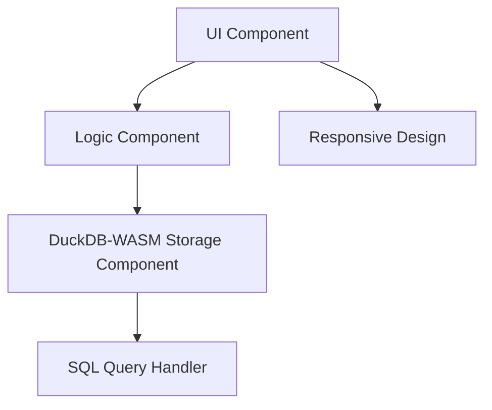

# TODO App Architecture (DuckDB-WASM Version)

This file provides the basic schema and mermaid diagrams showing the role of each component in the DuckDB-WASM TODO application.

## Components

1. **UI Component**: Interface with users. Handles TODO list display, addition, deletion, and editing.
2. **Storage Component**: Uses DuckDB-WASM to store data as an in-browser SQL database.
3. **Logic Component**: Manages logic for TODO addition, deletion, and editing.
4. **Responsive Design**: CSS for mobile browsers, design support with media queries.

## Mermaid Diagram



## Data Structure (SQL)

```sql
CREATE TABLE todos (
  id INTEGER PRIMARY KEY,
  text TEXT NOT NULL,
  done BOOLEAN DEFAULT FALSE
);
```

## Local WASM File Configuration

The TODO app uses DuckDB-WASM files locally to avoid CORS issues:

- `/public/duckdb-wasm/duckdb-eh.wasm` - DuckDB WebAssembly module
- `/public/duckdb-wasm/duckdb-browser-eh.worker.js` - DuckDB worker script

## Potential Causes of Problems

1. DuckDB-WASM initialization failure (browser compatibility, memory limits, etc.)
2. Insufficient async handling (DuckDB-WASM operates Promise-based)
3. SQL query errors (syntax mistakes or transaction issues)
4. WebAssembly module loading failure
5. Performance degradation (overhead during initial load)
6. Malfunction in browser incognito mode, etc.

## Most Likely Causes of Problems

1. DuckDB-WASM initialization failure and insufficient async handling
2. WebAssembly browser support issues

## Log Addition Plan for Hypothesis Verification

- Output detailed logs during DuckDB-WASM initialization process and each SQL query execution
- Add the following test code:

```javascript
// DuckDB-WASM initialization test
console.log("DuckDB-WASM initialization started");
try {
  // DuckDB-WASM initialization code
  console.log("DuckDB-WASM initialization successful");
} catch (error) {
  console.error("DuckDB-WASM initialization failed:", error);
}

// Data operation test
try {
  // Data operation code (INSERT/UPDATE/DELETE)
  console.log("Data operation successful:", /* operation details */);
} catch (error) {
  console.error("Data operation failed:", error);
}
```