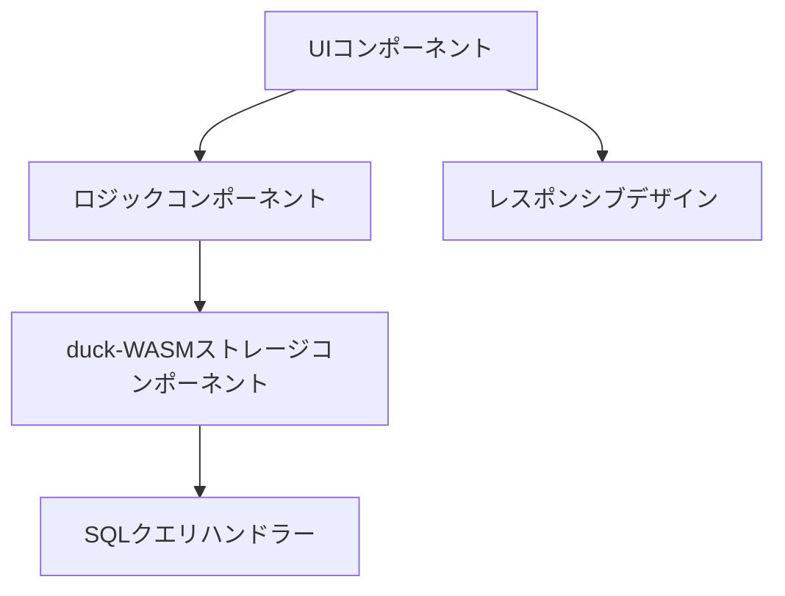

# TODOアプリのアーキテクチャ（duck-WASM版）

このファイルでは、duck-WASMを使用したTODOアプリの基本的なスキーマと各コンポーネントの役割を示すマーメイド図を提供します。

## コンポーネント
1. UIコンポーネント：ユーザーとのインターフェース。todo一覧、追加、削除、編集を担当。
2. ストレージコンポーネント：duck-WASMを使用してブラウザ内でSQLデータベースとしてデータの保存を担当。
3. ロジックコンポーネント：todo の追加、削除、編集のロジックを管理。
4. レスポンシブデザイン：スマホブラウザ向けの CSS、メディアクエリによるデザイン対応。

## マーメイド図



## データ構造（SQL）
```sql
CREATE TABLE todos (
  id INTEGER PRIMARY KEY,
  text TEXT NOT NULL,
  done BOOLEAN DEFAULT FALSE
);
```

## ローカルWASMファイルの構成
TODOアプリはCORSの問題を回避するために、duck-WASMのファイルをローカルで使用しています：

- `/public/duckdb-wasm/duckdb-eh.wasm` - DuckDBのWebAssemblyモジュール
- `/public/duckdb-wasm/duckdb-browser-eh.worker.js` - DuckDBのワーカースクリプト

## 想定される問題の原因
1. duck-WASM初期化の失敗（ブラウザの互換性、メモリ制限など）
2. 非同期処理のハンドリング不足（duck-WASMはPromiseベースで動作）
3. SQLクエリのエラー（構文ミスやトランザクション問題）
4. WebAssemblyモジュールのロード失敗
5. パフォーマンス低下（初回ロード時のオーバーヘッド）
6. ブラウザのシークレットモードなどでの動作不良

## 最も可能性が高い問題の原因
1. duck-WASM初期化の失敗と非同期処理のハンドリング不足
2. WebAssemblyのブラウザサポート問題

## 仮説検証のためのログ追加計画
- duck-WASMの初期化プロセスと各SQLクエリ実行時に詳細なログを出力
- 以下のテスト用コードを追加：
```javascript
// duck-WASM初期化テスト
console.log("duck-WASM初期化開始");
try {
  // duck-WASM初期化コード
  console.log("duck-WASM初期化成功");
} catch (error) {
  console.error("duck-WASM初期化失敗:", error);
}

// データ操作テスト
try {
  // データ操作コード（INSERT/UPDATE/DELETE）
  console.log("データ操作成功:", /* 操作内容 */);
} catch (error) {
  console.error("データ操作失敗:", error);
}
``` 