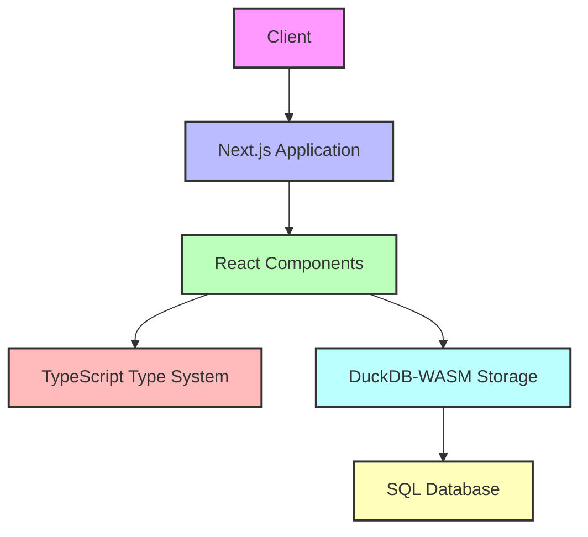
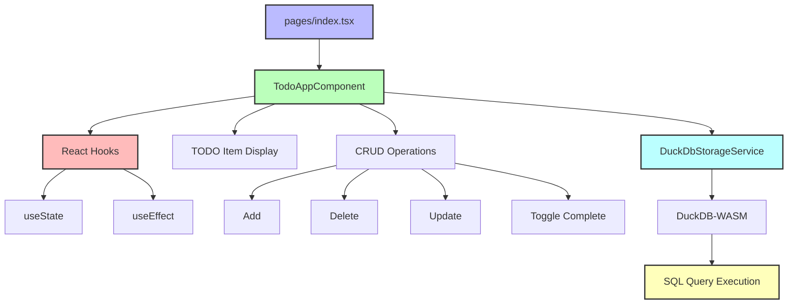
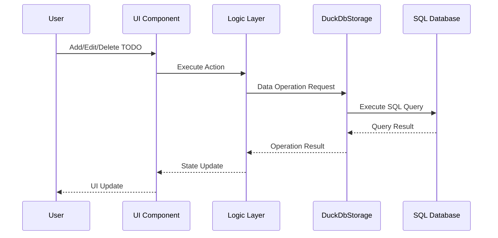
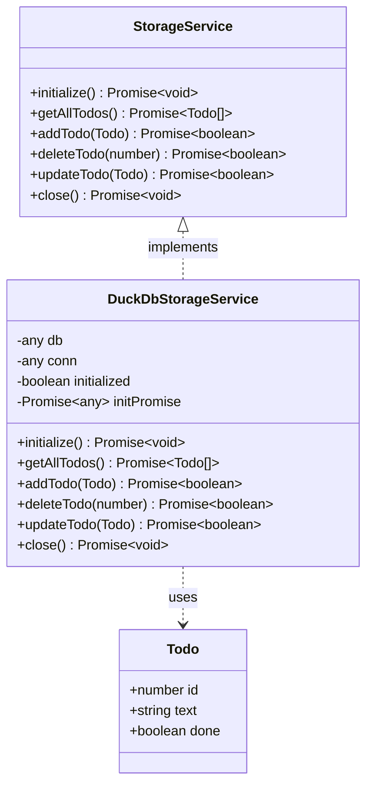
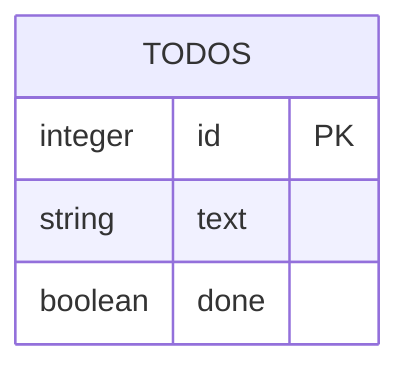

# TypeScript and Next.js Architecture

This document explains the architecture overview of the TODO application built with TypeScript and Next.js.

## Overall Architecture

## Component Structure

## Data Flow

## Type System

## Database Schema

## Technology Stack Overview

| Layer | Technology | Role |
|-------|------------|------|
| Frontend | React, TypeScript | UI construction, type-safe code |
| Application Framework | Next.js | Routing, SSR (disabled) |
| Data Storage | DuckDB-WASM (DuckDB) | In-browser SQL database |
| Testing | Jest, Testing Library | Unit tests, component tests |

## Potential Problems and Solutions

Problems that may occur with this architecture and their solutions:

1. **DuckDB-WASM Initialization Failure**
   - Cause: Browser compatibility, memory limitations
   - Solution: Enhanced error handling, fallback storage implementation

2. **Insufficient Async Handling**
   - Cause: Improper Promise implementation
   - Solution: Proper use of async/await pattern, improved error handling

3. **SQL Query Errors**
   - Cause: Syntax mistakes, transaction issues
   - Solution: Query testing, enhanced error logging

4. **Performance Issues**
   - Cause: Frequent rendering, inefficient queries
   - Solution: Memoization, optimized queries

5. **Browser Storage Limitations**
   - Cause: Local storage capacity limits
   - Solution: Data size monitoring, removal of unnecessary data