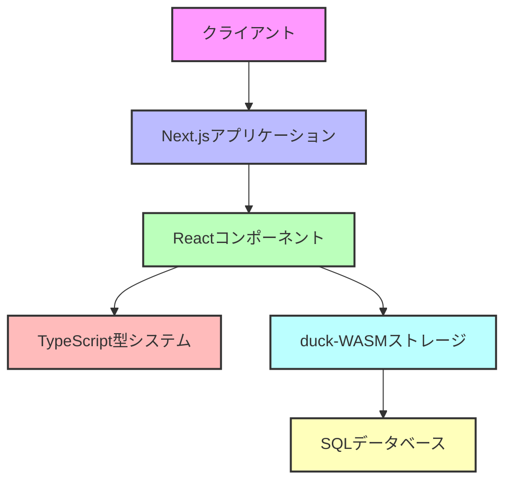
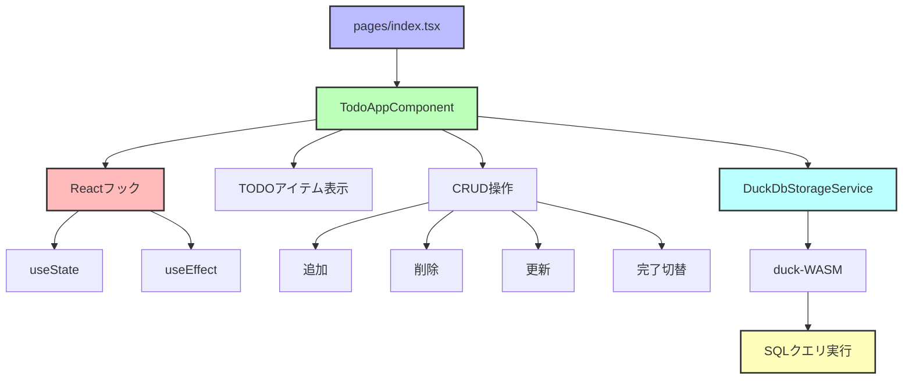
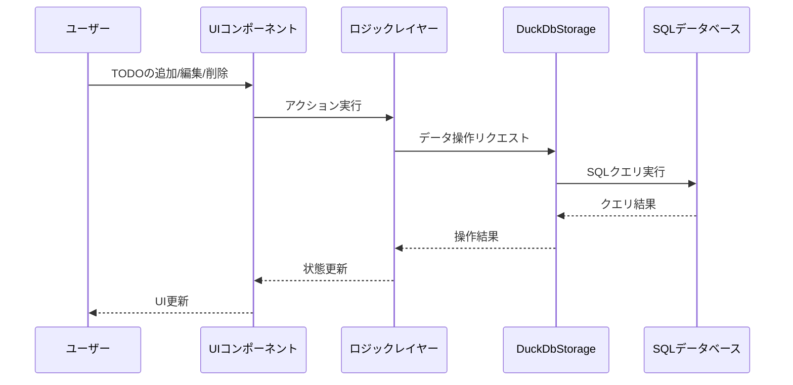
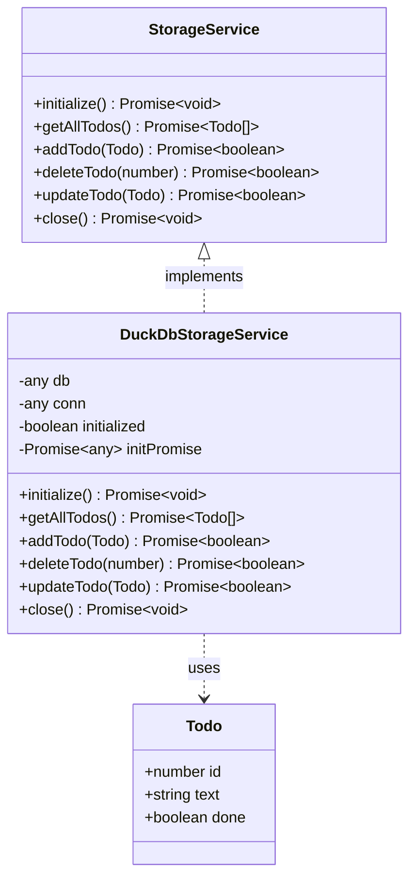
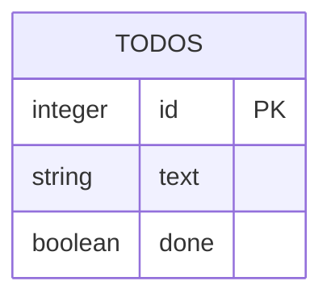

# TypeScriptとNext.jsアーキテクチャ

このドキュメントでは、TypeScriptとNext.jsを使用したTODOアプリのアーキテクチャ概要を説明します。

## 全体アーキテクチャ

## コンポーネント構成

## データフロー

## 型システム

## データベーススキーマ

## 技術スタック概要

| レイヤー | 使用技術 | 役割 |
|----------|----------|------|
| フロントエンド | React, TypeScript | UIの構築、型安全なコード |
| アプリケーションフレームワーク | Next.js | ルーティング、SSR(無効化) |
| データストレージ | duck-WASM (DuckDB) | ブラウザ内SQLデータベース |
| テスト | Jest, Testing Library | ユニットテスト、コンポーネントテスト |

## 問題の可能性と解決策

このアーキテクチャで発生する可能性がある問題と解決策：

1. **duck-WASM初期化の失敗**
   - 原因: ブラウザの互換性、メモリ制限
   - 解決策: エラーハンドリングの強化、フォールバックストレージの実装

2. **非同期処理のハンドリング不足**
   - 原因: Promise処理の不適切な実装
   - 解決策: async/awaitパターンの適切な使用、エラーハンドリング改善

3. **SQLクエリのエラー**
   - 原因: 構文ミス、トランザクション問題
   - 解決策: クエリテスト、エラーログ強化

4. **パフォーマンス問題**
   - 原因: 頻繁なレンダリング、非効率なクエリ
   - 解決策: メモ化、最適化されたクエリ

5. **ブラウザストレージの制限**
   - 原因: ローカルストレージの容量制限
   - 解決策: データサイズの監視、不要データの削除 